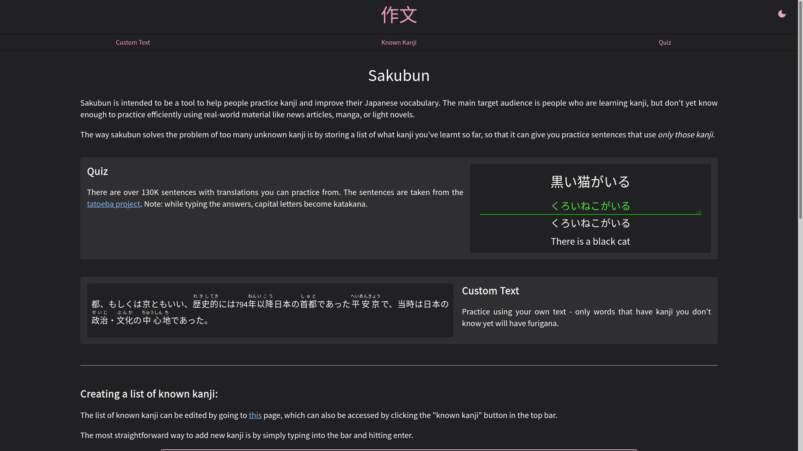
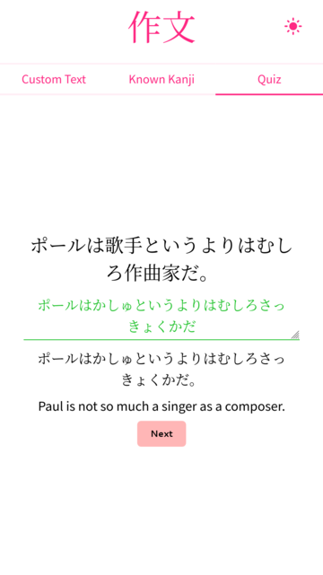
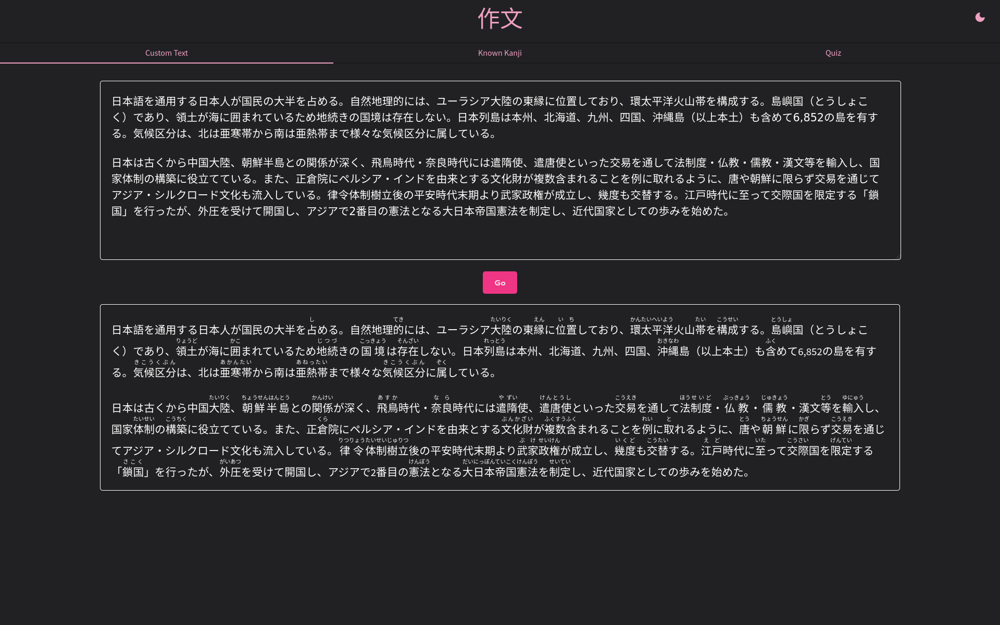

# Sakubun

Sakubun is intended to be a tool to help people practice kanji and improve their Japanese
vocabulary. The main target audience is people who are learning kanji, but don't yet know
enough to practice efficiently using real-world material like news articles, manga, or light
novels.

The way sakubun solves the problem of too many unknown kanji is by storing a list of what
kanji you've learnt so far, so that it can give you practice sentences that use _only
those kanji_.

The backend is written in rust, and the web server is powered by [rocket][1]. The `scripts`
directory has some scripts that were used to fetch data and stuff, but isn't used by the actual web
app.

## Quiz

There's a collection of over 130K sentences (with English translations) taken from the [tatoeba
project][2] you can practice with. [Kuroshiro][3] is used to generate kana readings and evaluate
user responses, and [WanaKana][4] is used to provide a rudimentary IME to type the answers.

## Custom Text

You can copy-paste Japanese text from anywhere, to get furigana over just the words words that have
kanji you don't know yet. The furigana is again generated with kuroshiro, like the kana readings in
the quiz.

## Screenshots

[1]: https://rocket.rs/
[2]: https://tatoeba.org/
[3]: https://github.com/hexenq/kuroshiro
[4]: https://github.com/WaniKani/WanaKana
